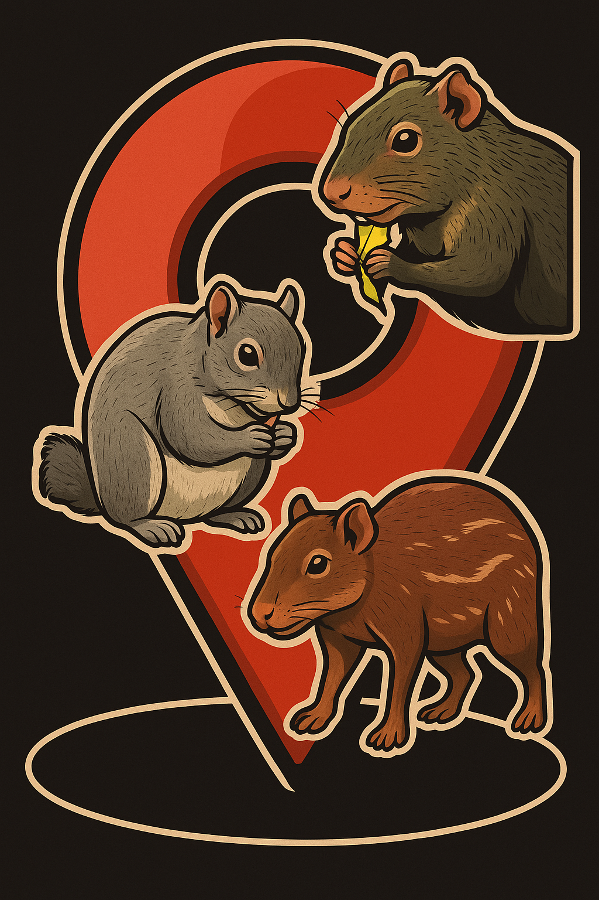

le
# Mamíferos de la Chinantla

> La Chinantla es la segunda región de México con mayor riqueza de este grupo de animales silvestres, lo que representa un gran orgullo, pero también una gran responsabilidad no solamente para el pueblo chinanteco sino para todos los oaxaqueños y mexicanos. [Los mamíferos de los bosques tropicales de la Chinantla,
Oaxaca, México](https://www.utm.mx/edi_anteriores/temas83/T83_E06_mamiferos_bosques_chinantla.pdf)

Proyecto Cámaras Trampa y Mamíferos de la Chinantla

Una cámara trampa es...

Conoce la ubicación de las estaciones
[Mapa de cámaras](https://eremun.github.io/MamChin/mapa_estaciones.html)

Conoce a los animales captados
[Mapa de avistamientos con fecha](https://eremun.github.io/MamChin/mapa_avistamientos_fechas.html)

Conoce más detalles de los avistamientos
[Mapa de avistamientos](https://eremun.github.io/MamChin/mapa_avistamientos_detalle.html)

